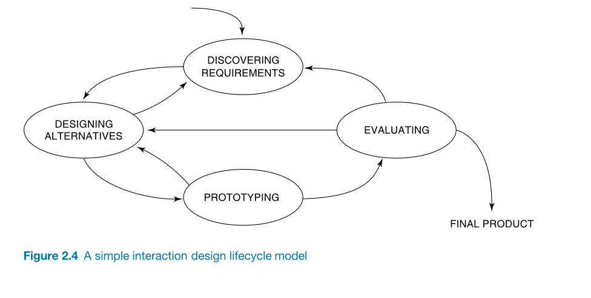

<!-- 

Last lec:
- Too long discussions 
- time flew 
-> need to manage time well
- tech issues need to be fixed
- video was cheesy 
- need more examples: Quotes, videos, case studies, stories, etc.
- principles are to be extracted not fed.

Goals today:

By the end of this lecture students will be able to:

- Understand the general process of interaction design 
- Able to know what is envolved in each phase of it 
- Practice the interaction design process on a mini scale 
- Appreciate the process 

How (idea):
- explain the process one by one
- they apply it as a group one by one
- reflection by me

Today's delighter:
- Role play: Make someone do an interview with you and then comment on it .. 

-->

SWE 503 | Lec 4 | Sep 2, 2025
# The Interaction Design Process (Part 2)
Dr. Omar Hammad

---

<!-- _class: left -->

# Revision of the last lecture:
- What is a good design?
- what would help us having a good design?
- What are the core principles of the People-Centered Approach?
- what does "Early focus on users and tasks" mean?
- What are the major activities in a design process?

---

<!-- _class: left -->

# In today's lecture:
- The Double Diamon Process 
- The Discover phase
- The Define phase
- The Develop phase
- The Deliver phase

---

<!-- _class: left boxes -->

# Basic activities of HCI

- Discover Requirements 
- Design Alternatives 
- Prototyping  
- Evaluating 

---

<!-- _class: light -->

# The simple process of Interaction Design

---

<!-- _class: light -->

# Double Diamond Process

-Design Council
---

# 1/4 Discover
To **understand**, rather than simply assume

-Design Council

---

<!-- _class: left -->

# Research questions include:

- Who are my users? 
- what do they know? 
- why might they be interested in this?
- What are their current challenges?
- What values do they care about? .. 
- What is their current situation in solving the problem?

---

<!-- class: center -->

# 2/4 Define
Working on the right problem

---

<!-- _class: left -->

# Define activities include:

- Clustering, affinity diagram, etc.
- Analyze data (quantitative, qualitative, etc.)
- Mapping (empathy map, scenario, journey map, etc.)
- Problem Definition 

---

<!-- _class: left -->

# Key outputs of Define phase:

- Problem Statement
- User Personas
- User Journey Maps
- Design Criteria

---

<!-- _class: activity left -->

~ 30 minutes
# Team up with someone and do some reasearch, then analyze it and write a problem statement
- Who are the cusomters (goals, needs, frustrations, etc.)? 
- In What context they are using the product? 
- What are some existing solutions?
- ... 

---

# 3/4 Develop
Come up with as **many solutions** as possible

---

<!-- _class: left -->

# Develop activities include:

- ideation 
- prototyping
- brainstorming
- mindmapping
- crazy 8s
- etc.

---

# 4/4 Deliver
Test the solution .. 

---

<!-- _class: activity left -->

~ 25 minutes
# Based on your problem statement, develop 3-5 design concepts, create a simple prototype of your best idea, then present how it addresses the problem .. 

---

# Is the new solution better than the old one?
Prove it .. 

---

<!-- _class: light -->

# The Complete Double Diamond Process

---

<!-- _class: left -->

# Next Class:

- Cognitive Aspects
- Read Chapter 2 of *Interaction Design, Beyond Human-Computer Interaction*

