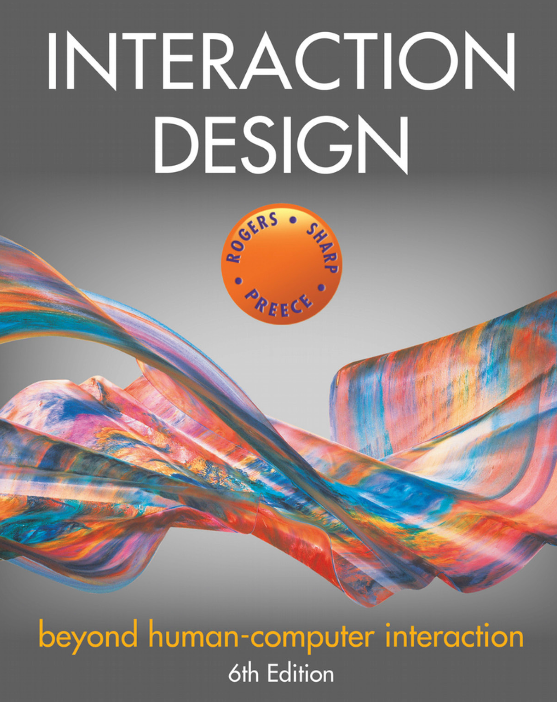
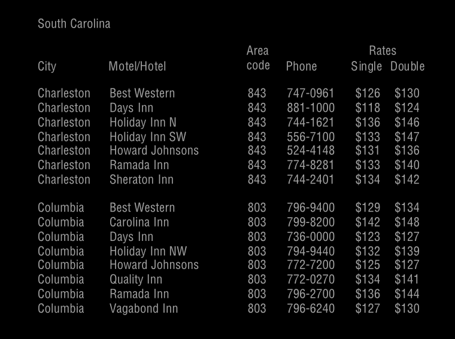

<!-- 

My goals of today's class is: 

- Give them the full picture of the rest of the course
- Start in the Cognitive aspects of HCI 
- Talk about attention 

By the end of this class, students will be able to: 
- Understand the full picture of what is coming 
- Understand understand what ic cognition and why it is important to understand 
- Understand the implications of attention in design 

How (idea):

- Conduct an experiment to make them feel attention 
- Map the course with the double diamon process & ask them to link
- Rremind them of the three core principles of HCI 
- Have a discussion about what is cognition & why do we study it
- Show them the different cognitive process and ask for more
- Give them the reading exercise to appreciate attention.
- Do the Fast vs Slow thinking 
- Explain the different types of thinking 
- Have a discussion about multitasking? Good or Bad?

 -->

SWE 503 | Lec 6 | Sep 9, 2025
# Cognitive Aspects of HCI 
Dr. Omar Hammad

--- 

Watch this video..
# https://www.youtube.com/watch?v=KB_lTKZm1Ts

---

<!-- _class: left -->

# In today's lecture:

- The full picture of the rest of the course
- Introduction toCognitive aspects 
- Attention 

---

<!-- _class: left -->

# Full picture:

1. Discover: ???
2. Define: ??
3. Develop: ??
4. Deliver: ??

---

<!-- _class: left -->

# Full picture:

1. Discover: Ch 4, 5, 6, 8
2. Define: Ch 9, 10, 11
3. Develop: Ch 12, 13
4. Deliver: Ch 14, 15, 16

---

# Remember the three core principles of HCI?

---

# Remember the three core principles of HCI?
<!-- _class: boxes -->

- **Early focus on users and tasks**
- Empirical measurement
- Iterative design

Understnad what in users ??

---

<!-- _class: activity -->

~ 5 minutes  
# Answer the following question on a piece of paper. 

---

# What was your proposal subfield?

---

# What is today’s date?

---

# y equals 2 times x minus 2. And you're given that x equals 3. So, what's the value of y?

---

# y = 3x - 2
# x = 2.5
# y = ?

---

# What was the slide color of the “What is today’s date?”

---

Today we will start with 
# Cognitve aspects

What is ?? 

---

# Cognitve aspects = Mental processes
Such as .. ??

---

<!-- _class: boxes -->

# Cognitve aspects

- Attention
- Memory
- Perception
- Decision
- Thinking 
- ...

They are all interconnected..

---

<!-- _class: activity h -->

#### Find the price of a double room at the Holiday Inn in Bradley,Pennsylvania

---

<!-- _class: activity h -->

#### Find the price for a double room at the Quality Inn in Columbia, South Carolina 

---

# What was the difference ?
Which was easier? why?

---

<!-- _class: boxes -->

# Attention is affected by
- Clear Goal 
- Presentation

---

# So what? 
What are the design implications of attention?

---

<!-- _class: left -->

# Design implications of attention
- Consider context (office vs driving, game vs work)
- Clear presentation (boxing, spacing, )
- Consider switching (e.g. info from ids)
- Demographics (e.g. age, etc.)

---

Next class: 
- Other cognitive aspects
- Cognitive frameworks 