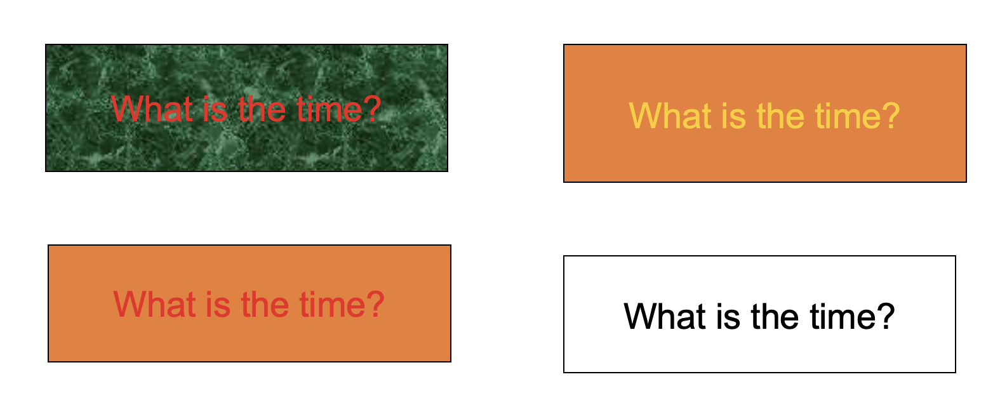
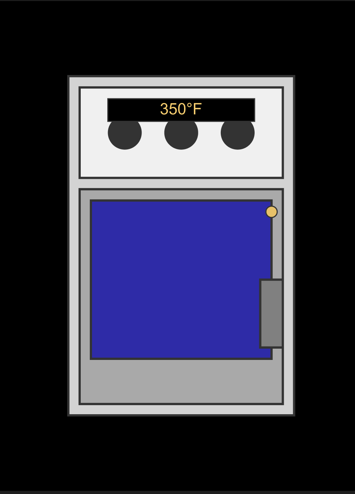

<!-- 

My goals of today's class is: 
- Explain Term Project 
- Explain Assignments 
- Discuss Syllabus 
- Discuss Cognitive aspects 
- Allow them to work on Lit review.
- Give them a Quiz at the end of the class.

Topics: 
- Memory
- Perception
- Decision
- Mental Models
- Cognitive Load

By the end of this class, students will be able to: 
- Understand what is expected from the them with regards to the term projects, and assignments
- Understand core concepts of Memory, Perception, Decision, Mental Models & Cognitive Load
- Practics the implications of these concepts in design

How (idea):
- 

 -->

SWE 503 | Lec 7 | Sep 19, 2025
# Cognitive Aspects of HCI (part 2)
Dr. Omar Hammad

---

<!-- _class: activity -->

Desert
مكتبة 
Algorithm
Jeddah
User Interface 
Falcon
تحليل 
Pixel
Cultural Heritage
Clickstream
Sand Dunes
بريد إلكتروني
Protocol

--- 

<!-- _class: left -->

# In today's lecture:

- Assignments timeline
- Perception
- Memory
- Decision
- Mental Models
- Cognitive Load

---

# Perception
Perception refers to how information is acquired from the environment via the five sense
organs (vision, hearing, taste, smell, and touch) and transformed into experiences of objects,events, sounds, and tastes (Roth, 1986)

---

<!-- Which one is easier to read? -->

# Which one is easier to read? 

---

Goal of Perception
## To present information in a way that can be readily perceived in the manner it was intended

---
# What are the design implications of perception?
---
<!-- _class: left -->

# What are the design implications of perception?
- Icons should enable users to distinguish their meaning readily
- Bordering and spacing are effective visual ways of grouping information
- Sounds should be audible and distinguishable
- Research proper color contrast techniques when designing an interface:
    - Yellow on black or blue is fine
    - Yellow on green or white is a no-no
- Haptic feedback should be used judiciously

---

<!-- _class: activity -->

~ 15 minutes
# Look for examples of User interfaces that are hard to perceive 

---

# Memory
Recalling various kinds of knowledge that allow people to act appropriately.

---

<!-- _class: activity -->
~ 15 minutes
# What do you recall from the initial list of words and why?

---

<!-- _class: left -->

# What do we know about memory?

---

<!-- _class: left -->

# What do we know about memory?
- It filters information
- Long term vs short term
- It is easier to recognize than recall
- It can be confused 
- ...

---

<!-- _class: left -->

# Our brains filters infomration
- Attention level ..
- Level of processing ..
- Context .. I've seen this before .. 

---

# Design implications of memory?

---

<!-- _class: left -->

# Design implications of memory
- Reduce cognitive load by avoiding long and complicated procedures for carrying out tasks
- Design interfaces that promote recognition rather than recall
- Provide users with various ways of labelling digital information to help them easily identify it again

---

# Decision

---

# How do we make decisions?

---

<!-- _class: activity left --> 

~ 10 minutes
# What was the last decision that you took? 
- What were the options?
- What were the aids that you used?
- What were the consequences?

---

<!-- _class: left -->

# How do we make decisions?
- think about what to do
- what are the available options
- what are the consequences of carrying out a given action
- We make a decision

---

<!-- _class: left -->

# Our goal is to make it faster, easier, accurate for users to take decisions
- What do they care about?
- How easy is it to compare options?
- Level of depth of the decision?
- How big are the consequences?

---

# Mental Models
How do we think about how things work?

---

More formally
# Internal constructions of some aspect of the external world that are manipulated, enabling predictions and inferences to be made 
-(Craik, 1943)

---

# What do we know about mental models?
- We generalize from our experiences
- People's experiences are different
- They are not always accurate

---

<!-- _class: left -->

# Qustion: Which gas oven will heat up faster? An oven set up to 350c or 250c?

---

<!-- _class: activity -->
~ 10 minutes
# What are some examples when you tried to use one product in a way becuase it worked in another product?

---

<!-- _class: left -->

# Simple examples .. 
- Clicking the elevator button multiple time ..
- Touching your laptop screen ..
- .. etc.

---

<!-- _class: left -->

# Design implications of mental models
- Understand where your users come from ..
- Build on top of their mental models ..
- Design for when things go wrong ..
- Don't confuse users ..

---

<!-- _class: activity left -->
~ 10 minutes
# Extracing the mental model of others.
- Ask a friend about something technical you are an expert in 
- Let them explain it to you 
- Notice the differences between your mental model and theirs

---

<!-- _class: left -->

# Next Class: 
- Emotional Aspects of HCI

---

